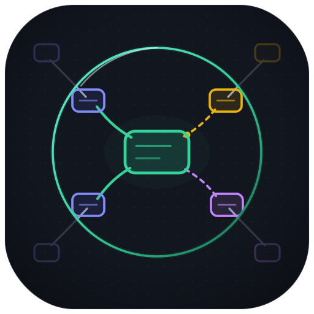
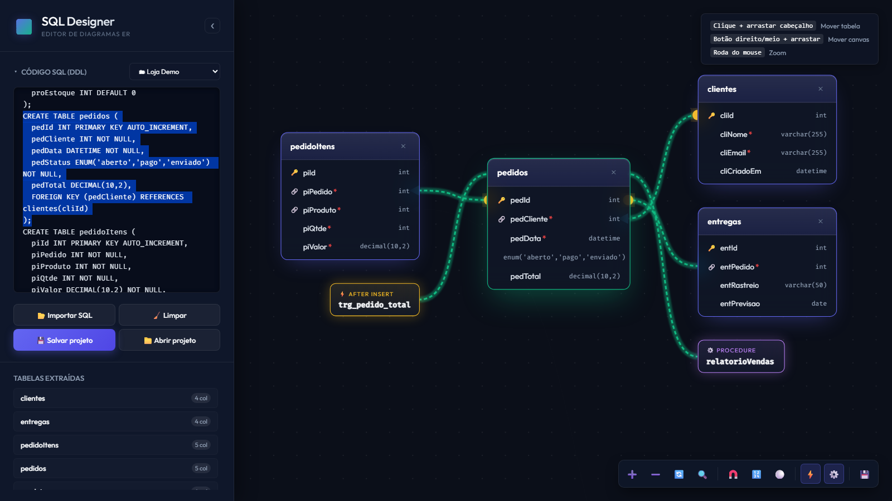

  

# sqlview-er

> Visualizador de diagramas ER 100% client-side: cole um dump SQL e navegue por tabelas, relacionamentos, **triggers e procedures**. Sem servidor, sem build, sem dependências — abre o `index.html` e pronto.

## A história (ou: por que isso existe)

Este projeto nasceu de uma necessidade pessoal misturada com uma curiosidade perigosa: **será que dá pra construir uma ferramenta inteira 100% codificada por IA?** Spoiler: deu. Nenhuma linha deste repositório foi digitada por um humano — eu só apontei, reclamei e aprovei.

A jornada começou no **Google Antigravity**, que montou um core bem interessante (parser, canvas, a base toda)... até esbarrar na composição da interface. Na hora de fazer o "clicou na tabela, acende as linhas, esmaece o resto", ele empacou de vez. Foi aí que o projeto migrou para o **Claude Code**, que encontrou os bugs herdados (alguns bem escondidos), terminou a interface e tocou todo o resto da evolução.

## O que ele NÃO é (leia antes de abrir uma issue brava)

- ❌ **Não é um produto.** Não tem roadmap, não tem SLA, não tem plano premium.
- ❌ **Não pretende substituir ferramenta nenhuma** — que, aliás, eu propositalmente **nem testei**. A ideia era partir do zero, não partir de algo.
- ❌ **Não quer virar um editor de schema.** A essência é ser uma ferramenta de **análise**: você joga o SQL, ele te mostra o mapa. Quem edita o banco é você, no lugar que você já usa pra isso.

> ⚠️ **Aviso legal:** tudo o que foi dito acima pode mudar de rumo a qualquer momento, por absoluta falta do que fazer num fim de semana e vontade de ir atrás de um novo laboratório. Considere-se avisado.

## O que ele faz

- **Parse de SQL DDL** direto do `CREATE TABLE` — incluindo dumps do `mysqldump` com `DELIMITER` e aqueles comentários condicionais `/*!50003 ... */` onde as triggers se escondem
- **Triggers, procedures e functions como nós do diagrama**, ligados às tabelas que eles tocam (com liga/desliga na toolbar)
- **Modo foco**: clique numa tabela e as relacionadas voam até ela, organizadas ao redor; o resto esmaece. `ESC` desfaz e tudo volta pro lugar
- **Multi-projetos** no navegador (localStorage): importe vários bancos e alterne pelo combo
- **Salvar/abrir projeto** em arquivo `.json` (backup, troca de máquina, mandar pro colega)
- Layouts automáticos (força, grade, círculo), zoom/pan, exportar **SVG**
- Editor SQL que rola até o `CREATE` da tabela/trigger selecionada
- Sidebar recolhível (`Ctrl+B`) pra quem quer só o canvas
- **Interface em 4 idiomas** (no ⚙️ de configurações): português, inglês, francês e — porque ninguém pediu — **Klingon** 🖖 (`raS tu'be'lu'. Qu'vatlh!`)

## Como usar

1. Clone ou baixe este repositório
2. Abra o `index.html` no navegador
3. Cole seu SQL (ou **Importar SQL**) e explore

É isso. Sem `npm install` de 300MB, sem Docker, sem servidor. O navegador é o ambiente.

## Contribuições

Pull requests são bem-vindos! Issues também — de bug a ideia maluca. Só lembre da essência lá de cima: **análise, não edição**. PRs que tentarem transformar isso num dbdiagram da vida vão receber um "obrigado, mas não" carinhoso. (A menos que me pegue num daqueles fins de semana. Vide aviso legal.)

### Quer traduzir? Isso sim é MUITO bem-vindo 🌍

Adicionar um idioma é a contribuição mais fácil do mundo: abra o [`lang.js`](lang.js), copie um dos blocos existentes (o `en` é um bom molde), traduza as ~50 chaves e pronto — **o seletor de idiomas no ⚙️ se monta sozinho** a partir do que estiver publicado ali. Sem registro, sem build, sem tocar em mais nenhum arquivo. Se o Klingon entrou, o seu idioma também entra. Esperanto? Guarani? Latim? Manda o PR.

---

## English (tl;dr)

**sqlview-er** is a 100% client-side ER diagram viewer: paste a SQL dump and explore tables, relationships, **triggers and procedures** as first-class diagram nodes. Born from a personal itch plus the curiosity of building a fully AI-coded project — started on Google Antigravity (which built a nice core but got stuck on the UI), finished and evolved on Claude Code. Not a product, not a replacement for anything (deliberately never even tried the alternatives — the point was starting from zero). It's an **analysis** tool, not an editor, and it intends to stay that way... unless a boring weekend says otherwise.

**Usage:** open `index.html` in your browser. That's it — no server, no build, no dependencies.

---

## Autor

**Argeu Carlos Thiesen** — argeu.thiesen@gmail.com

Codificado por IA (Google Antigravity + Claude Code), supervisionado por um humano com opiniões fortes.

O parceiro inicial desta jornada foi o **Claude Fable 5** — que encontrou os bugs, montou a interface e traduziu a ferramenta pra Klingon sem questionar minha sanidade. Quando ele deixar de fazer parte do meu pacote, quem assume o posto de copiloto do Argeu é o **Claude Opus 4.8**. A passagem de bastão está documentada aqui para fins históricos e sentimentais. 🤝

## Licença

[MIT](LICENSE)
