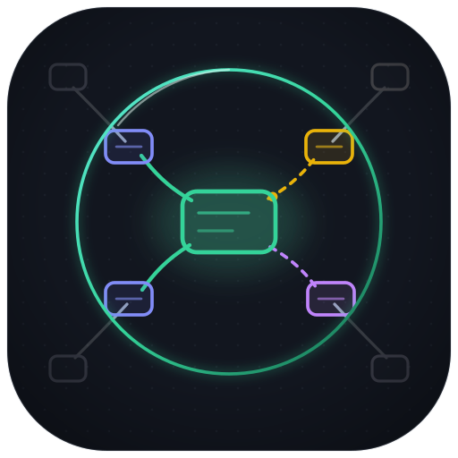
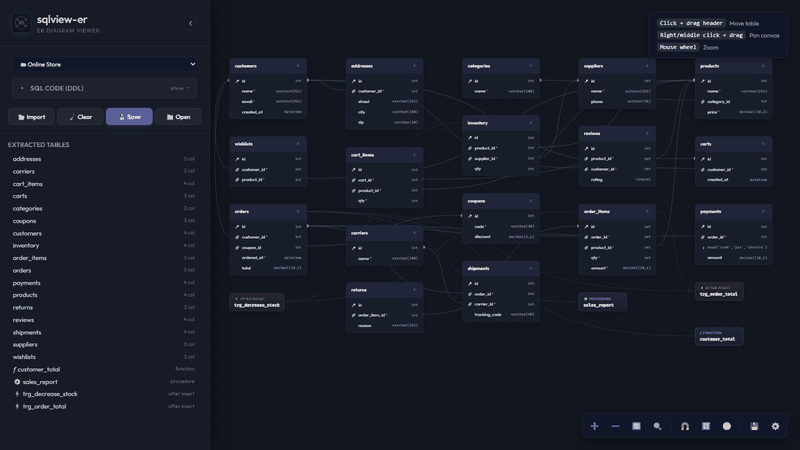
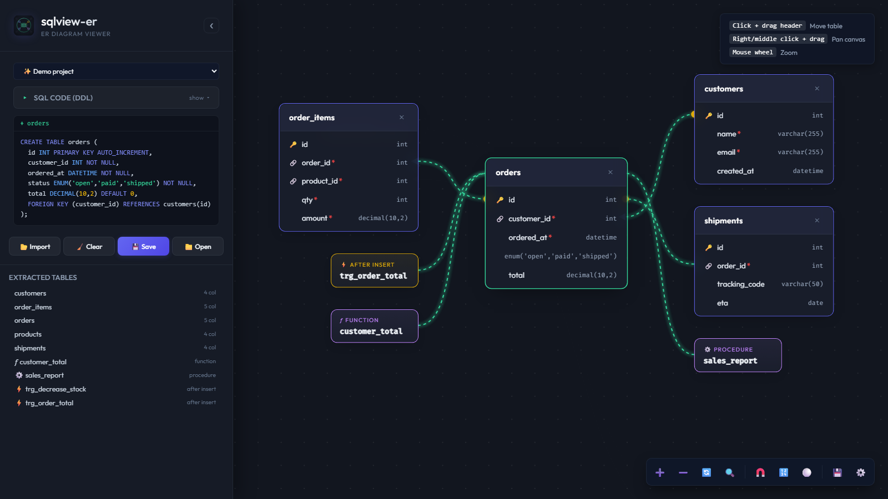

  

# sqlview-er

<strong>🇺🇸 English</strong> · <a href="README.pt-BR.md">🇧🇷 Português</a>

> Paste a SQL dump, get a map of your database — tables, relationships, and the **triggers, procedures and functions** everyone forgets are there, drawn as first-class nodes in the diagram. 100% client-side: no server, no build, no dependencies. Open `index.html` and you're done.

<strong>▶ <a href="https://argeuthiesen.github.io/sqlview-er/">Try it in your browser</a></strong> — nothing to install

## Why?

Because a database is more than its tables. The stuff that actually bites you in a legacy database is the logic hiding *around* them: the trigger that silently updates a total, the procedure nobody remembers, the function three reports depend on. In sqlview-er those show up in the diagram, wired to the tables they touch.

And because a 60-table spaghetti diagram helps nobody, there's **focus mode**: click a table and everything related to it flies over and gathers around it — tables, triggers, procedures — while the rest fades out. Click a neighbor to hop to it. `ESC` puts everything back where it was.

## What it does

- **Parses SQL DDL** straight from `CREATE TABLE` — including real-world `mysqldump` output with `DELIMITER` and those `/*!50003 ... */` conditional comments where triggers like to hide
- **Triggers, procedures and functions as diagram nodes**, linked to the tables they read or write (toggle them on/off in settings)
- **Focus mode**: click a table, its relatives gather around it, the rest fades; `ESC` undoes it all
- **Contextual DDL**: select anything and the editor jumps to its `CREATE` — or, with the editor folded, the sidebar shows just that snippet. No scrolling through a 5,000-line dump
- **Multiple projects** in the browser (localStorage): import several databases and switch from a dropdown
- **Save/open project** as a `.json` file (backup, another machine, sending it to a colleague)
- Auto layouts (force, grid, circle), zoom/pan, **SVG export**
- Collapsible sidebar (`Ctrl+B`) for canvas purists
- **UI in 4 languages** (⚙️ settings): English, Portuguese, French and — because nobody asked — **Klingon** 🖖 (`raS tu'be'lu'. Qu'vatlh!`)

## How to use

1. Clone or download this repo
2. Open `index.html` in your browser
3. Paste your SQL (or hit **Import**) and explore

That's it. No 300MB `npm install`, no Docker, no server. The browser *is* the runtime. Your SQL never leaves your machine.

## The story (or: why this exists)

This started as a personal itch mixed with a dangerous curiosity: **can you build an entire tool 100% coded by AI?** Spoiler: yes. Not a single line in this repo was typed by a human — I just pointed, complained and approved.

The journey began on **Google Antigravity**, which built a pretty solid core (parser, canvas, the whole foundation)... until it hit the UI composition. When it came to "click the table, light up its lines, fade the rest", it got stuck for good. That's when the project moved to **Claude Code**, which found the inherited bugs (some well hidden), finished the interface and has driven everything since.

## What it is NOT (read this before opening an angry issue)

- ❌ **Not a product.** No roadmap, no SLA, no premium plan.
- ❌ **Not trying to replace anything** — which, by the way, I deliberately **never even tried**. The point was to start from zero, not from something.
- ❌ **Not becoming a schema editor.** At its core it's an **analysis** tool: you throw SQL at it, it shows you the map. Editing the database is your job, wherever you already do that.

> ⚠️ **Legal notice:** everything above may change direction at any moment, out of sheer lack of anything better to do on a weekend and the urge to start a new lab experiment. Consider yourself warned.

## Contributing

Pull requests are welcome! Issues too — from bugs to crazy ideas. Just remember the core idea above: **analysis, not editing**. PRs trying to turn this into yet another dbdiagram will get a warm "thanks, but no". (Unless they catch me on one of those weekends. See legal notice.)

### Want to translate it? That one is VERY welcome 🌍

Adding a language is the easiest contribution in the world: open [`lang.js`](lang.js), copy one of the existing blocks (`en` is a good template), translate the ~50 keys and that's it — **the language picker in ⚙️ builds itself** from whatever is in there. No registration, no build, no other file to touch. If Klingon made it in, so can yours. Esperanto? Guarani? Latin? Send the PR.

---

## Author

**Argeu Carlos Thiesen** — argeu.thiesen@gmail.com · Brazil 🇧🇷

Coded by AI (Google Antigravity + Claude Code), supervised by a human with strong opinions.

The first partner on this journey was **Claude Fable 5** — who found the bugs, built the interface and translated the tool into Klingon without questioning my sanity. When it's no longer part of my plan, the copilot seat goes to **Claude Opus 4.8**. The handover is documented here for historical and sentimental purposes. 🤝

## License

[MIT](LICENSE)
